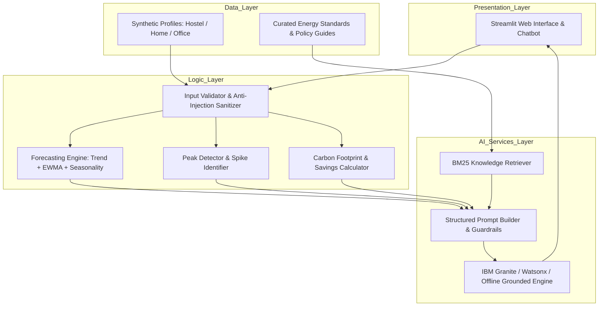

# AI-Powered Energy Consumption Forecasting & Optimization Assistant
> **Supporting UN Sustainable Development Goal 7: Affordable and Clean Energy**

[](https://www.python.org/downloads/)
[](https://streamlit.io)
[](https://sdgs.un.org/goals/goal7)
[](LICENSE)

---

## 1. Project Overview

The **AI-Powered Energy Consumption Forecasting & Optimization Assistant** is designed to empower individuals and small organizations (College Hostel Students, Residential Households, and Small Offices/Shops) to understand electricity usage, anticipate future consumption, eliminate peak-demand spikes, and lower both utility bills and carbon footprints.

The solution directly champions **UN Sustainable Development Goal 7 (Target 7.3: Double the global rate of improvement in energy efficiency)** by transforming abstract electricity figures into transparent, actionable habits and decision-support intelligence.

---
## Deployed link

https://energy-forecasting-8bvzxukqglbpl5dvwkwfzj.streamlit.app/

## Youtube link

https://youtu.be/zZ7w7TH5BIk


---

## 2. Key Capabilities & Features

| Feature | Description | PRD Alignment |
|---|---|---|
| **🔮 Energy Forecasting** | Pattern-based and trend-aware projection for the next 7 or 30 days with 95% confidence intervals | Section 1.5 (High) |
| **🚨 Peak Hour Alerts** | Automatic detection of consumption spikes and tailored Time-of-Day (ToD) load-shifting recommendations | Section 1.5 (High) |
| **💡 Smart Optimization Planner** | Interactive "What-If" simulator showing energy (kWh), financial (₹/$), and carbon (kg CO₂) savings across multi-tiered targets | Section 1.5 (High/Medium) |
| **🤖 AI Energy Advisor (RAG)** | Grounded conversational chatbot querying verified Bureau of Energy Efficiency (BEE) and appliance benchmarks | Section 1.5 & 1.6 (High) |
| **🌱 Carbon Footprint Tracking** | Calculates GHG emissions (kg CO₂e) and relatable eco-equivalencies (trees required, car km avoided) | Section 1.5 (Medium) |
| **📑 Submission Deliverables** | Auto-generates the complete 10-slide final presentation deck meeting PRD Section 4.2 checklist | Section 4.2 |

---

## 3. System Architecture



---

## 4. User Personas & Pre-Loaded Sample Data

1. **College Hostel Student** (`data/sample_hostel.csv`):
   - Typical range: 2.0 – 8.0 kWh/day.
   - Profile: High laptop, study lamp, room cooler, and morning electric geyser spikes.
2. **Residential Home (2-3 BHK)** (`data/sample_residential.csv`):
   - Typical range: 12.0 – 26.0 kWh/day.
   - Profile: Dual split inverter ACs, refrigerator, washing machine, and weekend family spikes.
3. **Small Office / Shop** (`data/sample_office.csv`):
   - Typical range: 25.0 – 70.0 kWh/day.
   - Profile: High weekday HVAC and computer workstation loads with low weekend server baseload.

---

## 5. Security, Privacy & Responsible AI

This implementation strictly implements the standards defined in **Section 3 of the PRD**:
- **Data Privacy**: No Personally Identifiable Information (PII) like names, meter IDs, or addresses is requested or stored.
- **In-Session Only**: All analysis is performed entirely in memory within the active user session; no persistent databases.
- **Anti-Prompt Injection**: Incoming text queries are scanned and sanitized against instruction override attempts (`ignore previous instructions`, `<script>`, system override tokens).
- **Transparency & Safety**: All outputs clearly state that predictions are approximate decision-support estimates. No advice facilitates electrical bypassing or unsafe wiring modifications.

---

## 6. Quick Start & Execution

### Prerequisites
- Python 3.10, 3.11, or 3.12 installed.

### Installation
Clone or navigate to the project directory:
```bash
cd Energy_Forecasting
pip install -r requirements.txt
```

### Run the Application
Launch the interactive Streamlit dashboard:
```bash
streamlit run app.py
```
Then open your browser at `http://localhost:8501`.

### Run Automated Unit Tests
To verify all core analytics, validators, RAG retrievers, and forecasting models:
```bash
python tests/test_core.py
```

---

